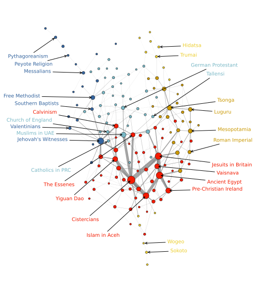

## Overview



Code for "Inferring Cultural Landscapes with the Inverse Ising Model" (https://www.mdpi.com/1099-4300/25/2/264) accepted in *Entropy* on the 25th of January 2023.
We would be very grateful for comments, questions, and thoughts. Parts of the analysis are easily reproducible, but a full reproduction is currently not possible since the raw dataset exceeds GitHub size limits. If a full reproduction is desired, please contact the authors. 

```
@article{poulsen2023inferring,
  title={Inferring Cultural Landscapes with the Inverse Ising Model},
  author={Poulsen, Victor M{\o}ller and DeDeo, Simon},
  journal={Entropy},
  volume={25},
  number={2},
  pages={264},
  year={2023},
  publisher={MDPI}
}
```

## Components
### ```/data```
* ```data/mdl_experiments```: processed DRH data (post-MPF).
* ```data/clean```: processed DRH data (pre-MPF).
* ```data/reference```: reference files (i.e. ensuring links between questions and cultures). 
* ```data/preprocessing```: files created from ```/preprocessing``` (used in ```/analysis```)
* ```data/analysis```: files created from ```/analysis```. 

Raw data from the DRH (i.e. pre-curation) is not provided given size limits. 
This might be available upon request. Everything after subset curation is provided.

### ```/fig```
Figures for "Inferring Cultural Landscapes with the Inverse Ising Model" (```5. Results: The Database of Religious History```)

### ```/tables```
Tables for "Inferring Cultural Landscapes with the Inverse Ising Model". (```5. Results: The Database of Religious History```)

### ```/preprocessing```
Preprocessing and data curation for the DRH (prior to ```/analysis```). Relies on ```Python``` and ```Julia```.
Some of the preprocessing (e.g. ```/preprocessing/preprocessing.py``` and ```/preprocessing/curation.py```) happens prior to the inference step, while the rest happens after. The raw data is not included here since it exceeds GitHub size limits, but the analysis can be reproduced from the inference step. For more, see the ```README``` in ```/preprocessing```.

### ```/analysis```
Code to reproduce the analysis, figures (```/fig```), and tables (```/tables```) related to the ```DRH``` case study. 
Where natural, one script reproduces a particular figure or table (e.g. ```/analysis/fig_3_parameters.py``` creates the two figures that make up *Figure 3* in the article). Some interdependencies between documents exist, e.g. ```/analysis/fig_4_landscape.py``` relies on ```/analysis/prep_fig_4_landscape.py``` and ```/analysis/fig_A1_dendrogram.py```. For more, see the ```README``` in ```/analysis```.

### ```/MPF_CMU``` 
MPF_CMU contains the optimized C code to implement all of the extensions and modifications to MPF described in our paper. Many of the simulations were carried out on the Bridges2 Pittsburgh Supercomputing Center system, and for speed they are set up to use multiple cores with OpenMP. You will want to adjust the Makefile to compile on your local system. Note that the compiler that ships with the new Mac M1s does not support OpenMP; you will need to install a (non-Apple) clang compiler. For details, see ```MPF_CMU```.

## Getting Started (DRH analysis)

Environments tested on ubuntu version 22.04 LTS. 

### Requirements 

Working installation of ```Python``` (tested with v3.10.6) and ```Julia``` (tested with v1.8.5).

### Installation

1. Clone the repo (if not already done). Here shown for ```ssh``` but ```https``` also fine:
    ```sh
    git clone git@github.com:victor-m-p/humanities-glass.git
    ```

2. Install the ```Python``` environment (```glassenv```):
    ```sh
    bash create_venv.sh
    bash add_venv.sh
    ```

3. Install the ```Julia``` packages used in the script (only ```/preprocessing/expand_data.jl```) with the Julia REPL.

<!-- LICENSE -->
## License
Distributed under the MIT License. See `LICENSE.txt` for more information.

## Contact
Simon DeDeo (for ```/MPF_CMU``` questions):
* Twitter: [@LaboratoryMinds](https://twitter.com/LaboratoryMinds)
* Github: [@simon-dedeo](https://github.com/simon-dedeo)
* Mail: sdedeo@andrew.cmu.edu

Victor Poulsen (for other questions): 
* Twitter: [@vic_moeller](https://twitter.com/vic_moeller) 
* GitHub: [@victor-m-p](https://github.com/victor-m-p)
* Mail: victormoeller@gmail.com

<!-- ACKNOWLEDGMENTS -->
## Acknowledgments
We are particularly grateful to the creaters of ```conIII``` and the maintainers and creators of the ```Database of Religious History (DRH)```.

* [ConIII](https://github.com/eltrompetero/coniii)
* [Database of Religious History (DRH)](https://religiondatabase.org/landing/)

## FUNDING
This work used the Extreme Science and Engineering Discovery Environment (XSEDE), which is supported by National Science Foundation grant number ACI-1548562. Specifically, it used the Bridges-2 system, which is supported by NSF award number ACI-1928147, at the Pittsburgh Supercomputing Center (PSC), under grant HUM220003. This work was supported in part by the Survival and Flourishing Fund.
